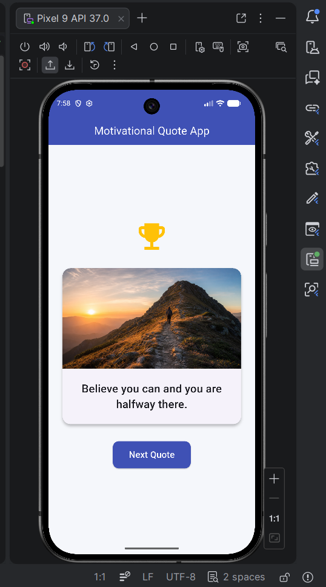
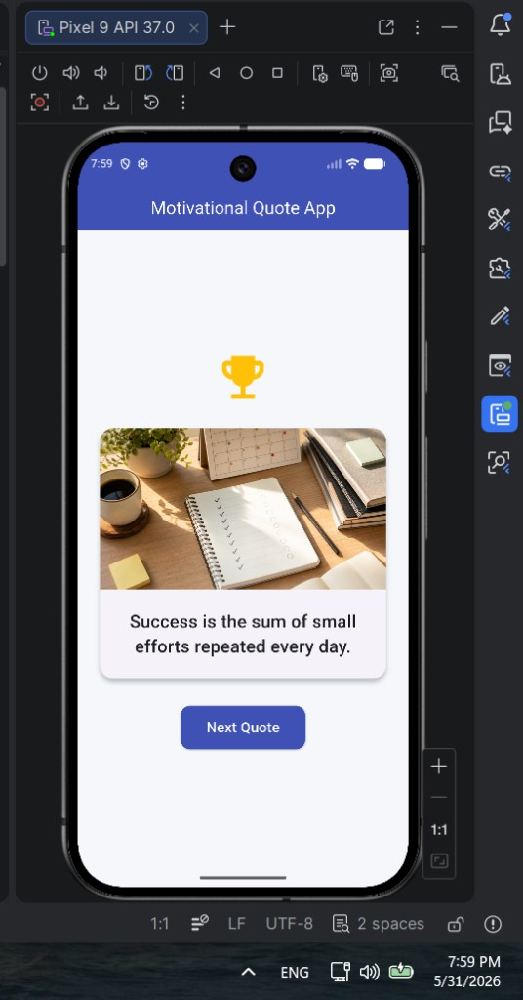
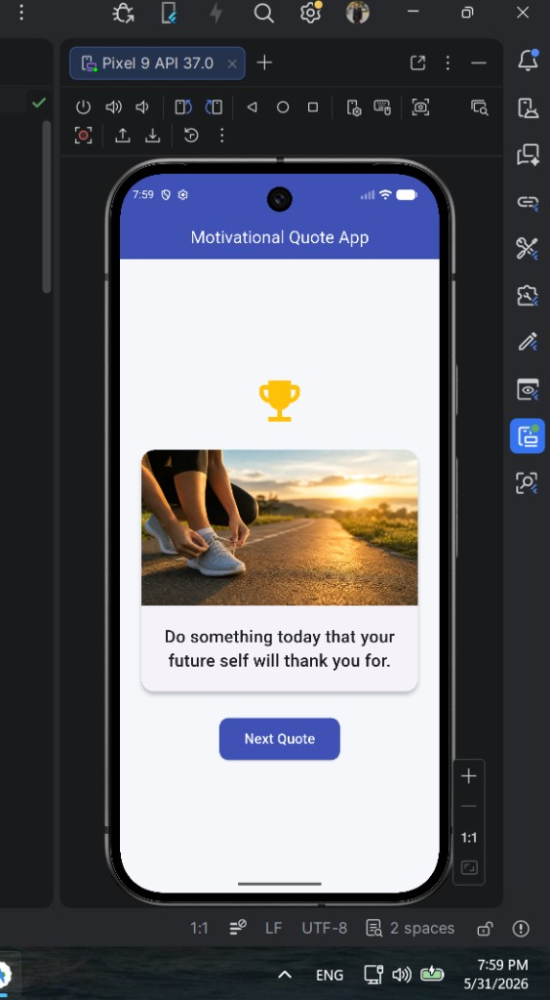
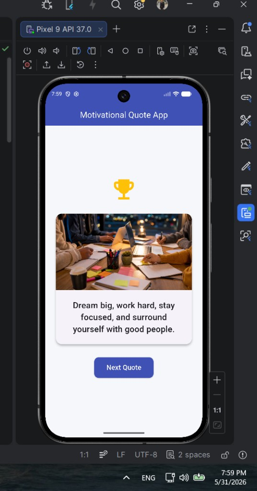
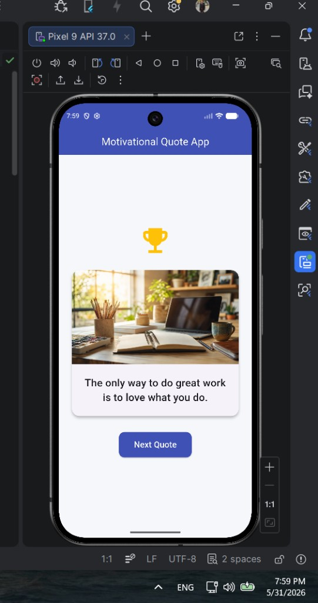

# Motivational Quote App

A simple, cross-platform Flutter app that displays inspirational quotes paired with matching images. Tap **Next Quote** to cycle through a curated set of five motivational messages.

Built with Material Design 3 and a clean indigo-and-white theme.

## Screenshots

| Quote 1 | Quote 2 |
| --- | --- |
|  |  |

| Quote 3 | Quote 4 |
| --- | --- |
|  |  |

| Quote 5 |
| --- |
|  |

## Features

- **Quote carousel** — Browse five hand-picked motivational quotes in a loop
- **Image pairing** — Each quote is shown with a related background image
- **Material 3 UI** — Modern card layout, indigo app bar, and responsive design
- **Cross-platform** — Runs on Android, iOS, Web, Windows, macOS, and Linux

## Tech Stack

| Layer | Technology |
| --- | --- |
| Framework | [Flutter](https://flutter.dev/) |
| Language | Dart (SDK ^3.12.0) |
| UI | Material Design 3 |
| State | `StatefulWidget` with local index state |

## Project Structure

```
Quote App/
├── lib/
│   └── main.dart              # App entry point and quote UI
├── assets/
│   └── images/                # Quote background images
├── docs/
│   └── screenshots/           # README screenshots
├── android/                   # Android platform files
├── ios/                       # iOS platform files
├── web/                       # Web platform files
├── windows/                   # Windows platform files
├── macos/                     # macOS platform files
├── linux/                     # Linux platform files
└── pubspec.yaml               # Dependencies and asset configuration
```

## Prerequisites

Before running the app, make sure you have:

- [Flutter SDK](https://docs.flutter.dev/get-started/install) installed and on your `PATH`
- A code editor (VS Code or Android Studio recommended)
- An emulator, physical device, or desktop target for your platform

Verify your setup:

```bash
flutter doctor
```

## Getting Started

1. **Clone the repository**

   ```bash
   git clone <repository-url>
   cd "Quote App"
   ```

2. **Install dependencies**

   ```bash
   flutter pub get
   ```

3. **Run the app**

   ```bash
   flutter run
   ```

   To run on a specific device:

   ```bash
   flutter devices          # list available targets
   flutter run -d <device>  # e.g. chrome, windows, emulator-5554
   ```

## Included Quotes

| # | Quote |
| --- | --- |
| 1 | Believe you can and you are halfway there. |
| 2 | Success is the sum of small efforts repeated every day. |
| 3 | Do something today that your future self will thank you for. |
| 4 | Dream big, work hard, stay focused, and surround yourself with good people. |
| 5 | The only way to do great work is to love what you do. |

## Learn More

- [Flutter documentation](https://docs.flutter.dev/)
- [Dart language tour](https://dart.dev/guides/language/language-tour)
- [Flutter widget catalog](https://docs.flutter.dev/ui/widgets)
